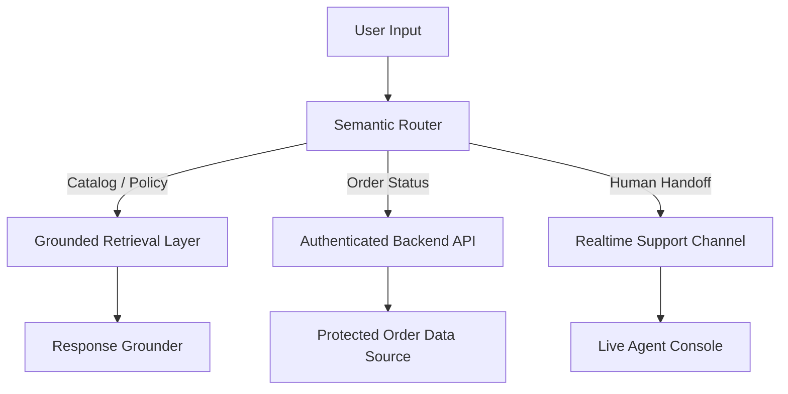

# Phase 6: Semantic AI Router - Context

**Gathered:** 2026-05-17
**Status:** Ready for planning

<domain>
## Phase Boundary

Replace brittle keyword-based intent detection across all services (catalog, off-topic, order) with real in-browser semantic routing using transformer.js or ONNX Runtime Web. The deterministic data retrieval pipeline stays untouched — only the "what does the user want?" layer changes.

This is the single highest-impact phase in the rewrite. It transforms the project's identity from "rule-based chatbot" to "AI-augmented agent" and directly addresses the judge's core finding.

**What this phase IS:**
- In-browser sentence embedding model for semantic intent detection
- Replace `lowerQuery.includes(keyword)` with embedding cosine similarity in CatalogIntentDetector, OffTopicDetector, OrderIntentDetector
- Keep keyword fallback for known exact phrases (belt-and-suspenders approach)
- Test suite for typo resilience, synonym handling, natural phrasing
- Update package.json with transformer.js/ONNX dependency

**What this phase IS NOT:**
- Not replacing the deterministic data pipeline (CatalogService, OrderService, PolicyService stay as-is)
- Not adding any LLM API calls (zero API costs, zero latency, zero privacy exposure)
- Not changing the ChatWidget pipeline flow — only the intent detection internals
- Not modifying the mock data sources (that's Phase 7)

</domain>

<decisions>
## Implementation Decisions

### D-01: Why in-browser semantic routing instead of an LLM API
**Decision:** Use transformer.js or ONNX Runtime Web with a lightweight BERT sentence embedding model.
**Reasoning:**
- Zero API costs — every catalog query stays free, unlike LLM APIs ($0.01-0.10/call)
- Zero latency — embeddings compute locally in <50ms, no network round-trip
- Zero privacy exposure — user queries never leave the browser
- Works offline — no dependency on external API availability
- ~30MB model file is acceptable for a Shopify widget (loaded once, cached)

### D-02: Hybrid approach — semantic primary, keyword fallback
**Decision:** Sentence embedding similarity as primary routing method. Keyword matching as fallback.
**Reasoning:**
- Semantic handles the long tail of natural language variation, typos, synonyms
- Keyword fallback ensures known phrases ("talk to human", "track order") always work deterministically
- Belt-and-suspenders: both methods agree? take the semantic result. Only one fires? take it. Neither? return 'not_catalog'/'none'

### D-03: Intent groups stay, detection method changes
**Decision:** Keep the existing intent taxonomy (stock_check, sizing_inquiry, product_search, variant_lookup, off-topic categories, order intents). Only change how queries are classified.
**Reasoning:** The intent categories are well-tested and product-validated. What's broken is the classification mechanism (exact substring), not the categories themselves.

### D-04: Model selection
**Decision:** Use `Xenova/all-MiniLM-L6-v2` via transformer.js (the most popular lightweight sentence embedding model, 22MB, 384-dimensional embeddings).
**Reasoning:**
- Most widely used sentence embedding model for transformer.js
- Well-documented, large community
- 22MB is the smallest viable BERT variant for sentence similarity
- 384-dim embeddings are fast to compare (cosine similarity in <1ms)

### D-05: Embedding cache
**Decision:** Cache computed embeddings per query text. If the same or very similar query appears again, reuse cached embedding.
**Reasoning:**
- Users often rephrase slightly (e.g., retry with different wording)
- Embedding computation is the most expensive part (~30-50ms per query)
- Cache at 5-min TTL, exact string key match (not semantic — that would be circular)

### D-06: No model download on page load
**Decision:** Lazy-load the model on first user query, not on widget initialization.
**Reasoning:**
- Widget loads in ~100ms today — don't add 30MB download to startup
- First query shows "Loading AI model..." state for ~1-2 seconds while model downloads
- After first load, model stays cached in browser (IndexedDB via transformer.js)

### D-07: Testing approach
**Decision:** Unit tests use pre-computed embedding fixtures (static arrays of expected embeddings for known test queries). Integration tests load the real model.
**Reasoning:**
- CI/CD environments may not have the model file or WebAssembly support
- Pre-computed fixtures make unit tests fast (<10ms each)
- Integration test (`catalogIntelligence.eval.test.ts`) loads real model

</decisions>

<canonical_refs>
## Canonical References

**Downstream agents MUST read these before planning or implementing.**

### Source of Truth — The Judge's Verdict
- `user_verdict.md` — Full judge verdict with rebuild brief. Read this FIRST. Sections "Semantic Typo Resilience", "Non-Negotiable Constraints", "Acceptance Criteria".
- `hackathon.md` — Submission deadline: May 20, 2026 11:59 PM IST

### Requirements & Roadmap
- `.planning/ROADMAP.md` §Phase 6 — Goal, success criteria, dependencies
- `.planning/STATE.md` — Current project state

### Existing Code — What Gets Replaced
- `src/services/catalogIntentDetector.ts` — `detectIntent()` method (lines 438-462), `searchProducts()` (lines 464-497). These get semantic routing injected.
- `src/services/offTopicDetector.ts` — `detectOffTopic()` method. Gets semantic upgrade.
- `src/services/orderIntentDetector.ts` — `detectOrderIntent()` method. Gets semantic upgrade.
- `src/services/synonymResolver.ts` — May be partially replaced by embeddings. Keep as fallback.

### Existing Code — What Stays
- `src/services/catalogService.ts` — Data retrieval stays deterministic. No changes.
- `src/services/orderService.ts` — Data retrieval stays deterministic. No changes.
- `src/services/policyService.ts` — Policy data stays deterministic. No changes.
- `src/services/escalationDetector.ts` — Escalation uses keyword + frustration signals, not semantic routing (by design). No changes.
- `shopify-widget/src/ChatWidget.ts` — Pipeline flow stays the same. No changes to _generateAgentResponse().

### Prior Phase Context
- `.planning/phases/03-live-catalog-intelligence/03-CONTEXT.md` — Original intent detection design decisions
- `.planning/phases/05-graceful-escalation/05-CONTEXT.md` — Pipeline integration pattern

### Architecture References
- `TECHNICAL_DOC.md` §2 — AI/Deterministic boundary documentation (needs update after this phase)
- `PRODUCT_DOC.md` — Product positioning (needs update after this phase)

### Source Code Structure
- `src/services/` — All service modules with `.test.ts` alongside
- `src/config/synonyms/` — `colors.ts`, `sizes.ts`, `materials.ts` — existing synonym configs, may be reduced in scope after semantic routing

### Existing Tests
- `src/services/catalogIntentDetector.test.ts` — 428 lines, covers all ResolvedQuery types
- `src/services/offTopicDetector.test.ts` — 163 lines, covers off-topic detection edge cases
- `src/services/orderIntentDetector.test.ts` — ~350 lines, covers order intent detection
- `src/tests/eval/catalogIntelligence.eval.test.ts` — 20 scenario eval tests for catalog queries

</canonical_refs>

<code_context>
## Existing Code Insights

### The Problem — Keyword-Based Intent Detection
Current `CatalogIntentDetector.detectIntent()` (lines 438-462):
```typescript
private detectIntent(lowerQuery: string): CatalogIntent | null {
  let bestIntent: CatalogIntent | null = null;
  let bestScore = 0;
  for (const [intent, group] of Object.entries(this.INTENT_GROUPS)) {
    const hasExclusion = group.excludes.some(k => lowerQuery.includes(k));
    if (hasExclusion) continue;
    let score = 0;
    for (const keyword of group.includes) {
      if (lowerQuery.includes(keyword)) score++;
    }
    if (score > bestScore) { bestScore = score; bestIntent = intent as CatalogIntent; }
  }
  return bestIntent;
}
```
This breaks on:
- Typos: "avialable" → no match for "available"
- Synonyms not in the list: "got medium blue pants?" → "pants" not in any keyword group
- Natural phrasing: "where's my stuff" → no keyword match at all

### The Solution — Semantic Intent Detection
```
User Query → Embedding Model (transformer.js) → 384-dim vector
           → Cosine similarity with pre-computed intent embeddings
           → Highest similarity wins (above threshold)
           → Fallback to keyword matching if below threshold
```

### The Target Architecture (from judge's verdict)


### Embedding Cache Strategy
```typescript
interface EmbeddingCache {
  query: string;        // exact query text (lowercased, trimmed)
  embedding: number[];  // 384-dim float array
  timestamp: number;    // when cached
}
// Cache TTL: 5 minutes (matches existing CONTEXT_TTL_MS)
// Key: SHA256 of lowercased query (fast string match)
```

</code_context>

<specifics>
## Specific Implementation Ideas

### SemanticRouter class
Create a standalone `SemanticRouter` class that:
1. Loads `Xenova/all-MiniLM-L6-v2` via transformer.js (lazy load)
2. `embed(text: string): Promise<number[]>` — returns 384-dim embedding
3. `similarity(a: number[], b: number[]): number` — cosine similarity
4. `classify(query: string, categories: Record<string, string[]>): Promise<string | null>` — returns best matching category label or null

### Integration with existing detectors
- `CatalogIntentDetector` gets a `semanticRouter: SemanticRouter` constructor parameter
- `detectIntent()` now calls `semanticRouter.classify(query, INTENT_GROUPS_SEMANTIC)` first, falls back to keyword matching if confidence < 0.6
- `OffTopicDetector` gets the same treatment — semantic off-topic detection
- `OrderIntentDetector` uses semantic routing to distinguish order queries from non-order queries

### Reference embeddings for intents
Each intent category gets 3-5 reference phrases (pre-computed at build time):
```typescript
const INTENT_REFERENCE_PHRASES = {
  stock_check: [
    "is this in stock",
    "how many do you have",
    "is it available",
    "do you have stock",
  ],
  sizing_inquiry: [
    "what sizes do you have",
    "does it come in small",
    "sizing information",
    "how does it fit",
  ],
  // ... etc
};
```

### Lazy loading UX
When the model is loading, show a brief "Processing..." state in the widget. The model should cache in IndexedDB after first load so subsequent page visits are instant.

</specifics>

<deferred>
## Deferred Ideas

- **Multilingual support** — The model is English-only. Stick with English for the hackathon.
- **Fine-tuning** — Pre-trained MiniLM is sufficient. Fine-tuning on store-specific data is post-hackathon.
- **On-device training** — No. The model is pre-trained and used as-is.
- **Embedding quantization** — int8 quantization could reduce model size further. Save for polish.
- **Progressive enhancement** — If transformer.js fails to load (outdated browser), fall back to original keyword matching entirely.

</deferred>

---

*Phase: 06-semantic-ai-router*
*Context gathered: 2026-05-17*
