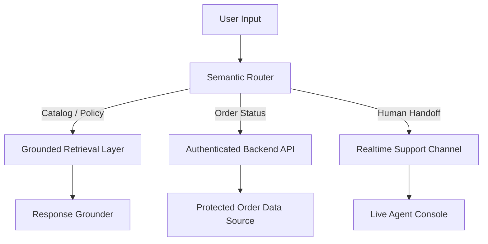

# Phase 6: Semantic AI Router - Context

**Gathered:** 2026-05-17
**Status:** Ready for planning

<domain>
## Phase Boundary

Replace brittle keyword-based intent detection across all services (catalog, off-topic, order) with real in-browser semantic routing using `@xenova/transformers` with `Xenova/all-MiniLM-L6-v2`. The deterministic data retrieval pipeline stays untouched — only the "what does the user want?" layer changes.

This is the single highest-impact phase in the rewrite. It transforms the project's identity from "rule-based chatbot" to "AI-augmented agent" and directly addresses the judge's core finding.

**Project-wide principle:** Semantic router is intent-only, never data-source-aware. Mock data is the default data source. When a live API is connected (Phase 7), it automatically becomes the source of truth. Questions unrelated to mock data or live API calls are always entertained.

**What this phase IS:**
- In-browser sentence embedding model for semantic intent detection
- Replace `lowerQuery.includes(keyword)` with embedding cosine similarity in CatalogIntentDetector, OffTopicDetector, OrderIntentDetector
- Keep keyword fallback for known exact phrases (belt-and-suspenders approach)
- New `src/config/semantic/` directory with reference phrase configs and pre-computed embeddings
- Build-time embedding generation via npm prebuild hook
- Test suite for typo resilience, synonym handling, natural phrasing
- Update package.json with `@xenova/transformers` dependency

**What this phase IS NOT:**
- Not replacing the deterministic data pipeline (CatalogService, OrderService, PolicyService stay as-is)
- Not adding any LLM API calls (zero API costs, zero latency, zero privacy exposure)
- Not changing the ChatWidget pipeline flow — only the intent detection internals
- Not modifying the mock data sources (that's Phase 7)

</domain>

<decisions>
## Implementation Decisions

### D-01 through D-07 (from prior context — carried forward)
These remain locked. See below for full list.

### Project-Wide Principle
- **P-01:** Semantic router is intent-only, never data-source-aware. Mock data is default. Live API (Phase 7) auto-becomes source of truth. Questions unrelated to data sourcing are always answered.

### D-01: Why in-browser semantic routing instead of an LLM API
**Decision:** Use `@xenova/transformers` with a lightweight BERT sentence embedding model.
**Reasoning:**
- Zero API costs — every catalog query stays free, unlike LLM APIs ($0.01-0.10/call)
- Zero latency — embeddings compute locally in <50ms, no network round-trip
- Zero privacy exposure — user queries never leave the browser
- Works offline — no dependency on external API availability
- ~30MB model file is acceptable for a Shopify widget (loaded once, cached)

### D-02: Hybrid approach — semantic primary, keyword fallback
**Decision:** Sentence embedding similarity as primary routing method. Keyword matching as fallback.
**Reasoning:**
- Semantic handles the long tail of natural language variation, typos, synonyms
- Keyword fallback ensures known phrases ("talk to human", "track order") always work deterministically
- Belt-and-suspenders: both methods agree? take the semantic result. Only one fires? take it. Neither? return 'not_catalog'/'none'
- Conflict resolution: highest confidence score wins

### D-03: Intent groups stay, detection method changes
**Decision:** Keep the existing intent taxonomy (stock_check, sizing_inquiry, product_search, variant_lookup, off-topic categories, order intents). Only change how queries are classified.

### D-04: Model selection
**Decision:** Use `Xenova/all-MiniLM-L6-v2` via `@xenova/transformers` (22MB, 384-dimensional embeddings).

### D-05: Embedding cache
**Decision:** Cache computed embeddings per query text (5-min TTL, exact string key match).

### D-06: No model download on page load
**Decision:** Lazy-load the model on first user query, not on widget initialization.

### D-07: Testing approach
**Decision:** Unit tests use pre-computed embedding fixtures (static arrays). Integration tests load the real model.

### D-08: Transformer.js integration method
**Decision:** npm bundler import (`@xenova/transformers` via package.json). Standard npm install, bundled via existing build step. Cleanest integration, tree-shaken.

### D-09: Model file storage
**Decision:** IndexedDB auto-caching via transformer.js. Zero custom code — the library handles caching internally.

### D-10: Loading state UX
**Decision:** Show "Loading AI model…" text during first model download (~1-2 seconds). Honest, transparent.

### D-11: First-query behavior during model load
**Decision:** Queue the first user query, process it semantically after the model finishes loading. Transparent queuing, no keyword fallback for the first query.

### D-12: Reference embedding strategy
**Decision:** Pre-computed build-time constants. A build script generates embeddings.json from reference phrases.

### D-13: Reference phrase config location
**Decision:** New `src/config/semantic/` directory. One file per intent domain (catalogIntents.ts, offTopicIntents.ts, orderIntents.ts).

### D-14: Reference phrase count per intent
**Decision:** 5-8 reference phrases per intent category. Broader coverage for robust matching.

### D-15: Build-time embedding generation
**Decision:** Inline in build pipeline — `npm run build` automatically generates embeddings via prebuild hook.

### D-16: CI failure behavior
**Decision:** If embedding generation fails during build, the build fails. Ensures reference embeddings are always in sync.

### D-17: Embeddings file in version control
**Decision:** `embeddings.json` is `.gitignore`d and always regenerated during build.

### D-18: Development fallback
**Decision:** No fallback — build must run before developing or testing. Ensures embeddings are always fresh.

### D-19: Embeddings file format
**Decision:** Flat JSON — single `embeddings.json` with `{ intentName: { phrases: string[], embeddings: number[][] } }` structure.

### D-20: SemanticRouter class API shape
**Decision:** Single `classify(query, categoryRefs)` method returning `{ intent: string | null, confidence: number }`. Highest similarity above threshold wins.

### D-21: Confidence threshold
**Decision:** 0.6 threshold for accepting semantic result. Below this → fall back to keyword matching.

### D-22: Instance management
**Decision:** Singleton pattern — one SemanticRouter instance shared across all detectors (catalog, order, off-topic).

### D-23: Hybrid conflict resolution
**Decision:** Highest confidence wins. Compare semantic confidence vs keyword confidence score, whichever is higher and above threshold determines the result.

### D-24: Semantic off-topic detection approach
**Decision:** Semantic on-topic check — reference embeddings for each supported domain (products, orders, policies). Query not close to any on-topic cluster → off-topic suspicion → keyword fallback for final verdict.

### D-25: Keyword list retention
**Decision:** Keep full `ON_TOPIC_KEYWORDS` and `OFF_TOPIC_KEYWORDS` lists as fallback. No reduction — belt-and-suspenders.

### D-26: On-topic semantic categories
**Decision:** Three clusters: products, orders, policies. Reference phrases cover all three domains.

### D-27: Model failure behavior
**Decision:** Silent fallback to keyword matching. No user-visible error. Console.error for developer diagnostics.

### D-28: Model download retry
**Decision:** Retry once on download failure. If both attempts fail, fall back to keyword matching for the session.

### D-29: First-query queuing
**Decision:** Queue first user query during model load. Process semantically once model is ready. If model never loads, fall back to keywords.

### D-30: Return service code cleanup
**Decision:** Wrap return service in a feature flag (`enableReturnService: false`). Not removed — feature-flagged for clean reactivation.

### D-31: Feature flag import behavior
**Decision:** When `enableReturnService` is false, skip importing `ReturnService` and `MockReturnDataSource` entirely. Reduces bundle size.

### D-32: Phased rollout order
**Decision:** All 3 detectors at once — catalog, order, and off-topic semantic routing in a single PR. The shared SemanticRouter singleton makes incremental rollout unnatural.

### D-33: Integration test scope
**Decision:** Full regression against existing eval tests — run all existing eval scenarios through the semantic pipeline and verify results match or improve on keyword-only accuracy.

### D-34: Regression test location
**Decision:** Extend existing eval test file (`src/tests/eval/catalogIntelligence.eval.test.ts`). All eval tests in one place.

### OpenCode's Discretion
- Exact reference phrases for each intent category (5-8 per intent)
- Exact format of embeddings.json (key names, nesting)
- SemanticRouter internal implementation details (embedding normalization, pipeline)
- Widget integration details (how to show "Loading AI model…" state)
- Exact npm script name for embedding generation
- Build tool configuration for prebuild hook

</decisions>

<canonical_refs>
## Canonical References

**Downstream agents MUST read these before planning or implementing.**

### Source of Truth — The Judge's Verdict
- `user_verdict.md` — Full judge verdict with rebuild brief. Read this FIRST. Sections "Semantic Typo Resilience", "Non-Negotiable Constraints", "Acceptance Criteria".
- `hackathon.md` — Submission deadline: May 20, 2026 11:59 PM IST

### Requirements & Roadmap
- `.planning/ROADMAP.md` §Phase 6 — Goal, success criteria, dependencies
- `.planning/STATE.md` — Current project state

### Prior Phase Context
- `.planning/phases/05-graceful-escalation/05-CONTEXT.md` — Pipeline integration pattern, escalation detection slot position
- `.planning/phases/04-order-tracking-workflow/04-CONTEXT.md` — Interface-driven service pattern, ChatWidget pipeline pattern
- `.planning/phases/03-live-catalog-intelligence/03-CONTEXT.md` — Original intent detection design decisions, keyword taxonomy

### Existing Code — What Gets Replaced
- `src/services/catalogIntentDetector.ts` — `detectIntent()` method, `searchProducts()`. Gets semantic routing injected.
- `src/services/offTopicDetector.ts` — `detectOffTopic()` method. Gets semantic upgrade.
- `src/services/orderIntentDetector.ts` — `detectOrderIntent()` method. Gets semantic upgrade.
- `src/services/synonymResolver.ts` — May be partially replaced by embeddings. Keep as fallback.

### Existing Code — What Stays
- `src/services/catalogService.ts` — Data retrieval stays deterministic. No changes.
- `src/services/orderService.ts` — Data retrieval stays deterministic. No changes.
- `src/services/policyService.ts` — Policy data stays deterministic. No changes.
- `src/services/escalationDetector.ts` — Escalation uses keyword + frustration signals, not semantic routing (by design). No changes.
- `shopify-widget/src/ChatWidget.ts` — Pipeline flow stays the same. Only detection internals change. Return service gets feature-flagged.

### Architecture References
- `TECHNICAL_DOC.md` §2 — AI/Deterministic boundary documentation (needs update after this phase)
- `PRODUCT_DOC.md` — Product positioning (needs update after this phase)

### Source Code Structure
- `src/services/` — All service modules with `.test.ts` alongside
- `src/config/synonyms/` — `colors.ts`, `sizes.ts`, `materials.ts` — existing synonym configs, may be reduced in scope after semantic routing
- `src/config/semantic/` — New directory for reference phrases and pre-computed embeddings

### Existing Tests
- `src/services/catalogIntentDetector.test.ts` — 428 lines, covers all ResolvedQuery types
- `src/services/offTopicDetector.test.ts` — 163 lines, covers off-topic detection edge cases
- `src/services/orderIntentDetector.test.ts` — ~350 lines, covers order intent detection
- `src/tests/eval/catalogIntelligence.eval.test.ts` — 20 scenario eval tests for catalog queries

</canonical_refs>

<code_context>
## Existing Code Insights

### The Problem — Keyword-Based Intent Detection
Current `CatalogIntentDetector.detectIntent()` (lines 438-462) uses `lowerQuery.includes(keyword)` which breaks on:
- Typos: "avialable" → no match for "available"
- Synonyms not in the list: "got medium blue pants?" → "pants" not in any keyword group
- Natural phrasing: "where's my stuff" → no keyword match at all

`OffTopicDetector.detectOffTopic()` uses the same pattern with `ON_TOPIC_KEYWORDS` + `OFF_TOPIC_KEYWORDS` arrays and `includes()` matching.

`OrderIntentDetector.detectIntent()` uses keyword groups with the same includes/excludes pattern plus regex for order numbers.

### The Solution — Semantic Intent Detection
```
User Query → Embedding Model (transformer.js) → 384-dim vector
           → Cosine similarity with pre-computed intent embeddings
           → Highest similarity wins (above 0.6 threshold)
           → Fallback to keyword matching if below threshold
```

### The Target Architecture (from judge's verdict)


### Embedding Cache Strategy
```typescript
interface EmbeddingCache {
  query: string;        // exact query text (lowercased, trimmed)
  embedding: number[];  // 384-dim float array
  timestamp: number;    // when cached
}
// Cache TTL: 5 minutes (matches existing CONTEXT_TTL_MS)
// Key: SHA256 of lowercased query (fast string match)
```

### Build-Time Embedding Generation
npm prebuild hook runs a script that:
1. Loads `Xenova/all-MiniLM-L6-v2`
2. Reads reference phrases from `src/config/semantic/*.ts`
3. Generates `src/config/semantic/embeddings.json`
4. If generation fails, build fails

### Reusable Assets
- **CatalogIntentDetector** (`src/services/catalogIntentDetector.ts:438-462`) — Pattern for injecting SemanticRouter
- **OffTopicDetector** (`src/services/offTopicDetector.ts`) — Pattern for keyword-based detection, will receive semantic on-topic check
- **ChatWidget pipeline** (`shopify-widget/src/ChatWidget.ts:564-665`) — All detectors called here, injection points
- **ConversationContextManager** (`src/services/conversationContext.ts`) — Existing 5min/3turn context expiry pattern for embedding cache

### Established Patterns
- **Interface-first design** — Each service defines an interface/type, then mock implementation
- **src/services/ organization** — Each service in its own `.ts` module with `.test.ts` alongside
- **TDD workflow** — Tests required before implementation, 80%+ coverage
- **ChatWidget pipeline** — off-topic → escalation → order → catalog → policy → greeting → fallback
- **Hybrid detection pattern** — Semantic primary + keyword fallback (new)

### Integration Points
- **CatalogIntentDetector constructor** — Add `semanticRouter` parameter
- **OffTopicDetector constructor** — Add `semanticRouter` parameter
- **OrderIntentDetector constructor** — Add `semanticRouter` parameter
- **ChatWidget constructor** — Create singleton SemanticRouter, pass to all 3 detectors
- **ChatWidget._generateAgentResponse()** — First query waits for model load
- **ReturnService import** — Wrap in `enableReturnService` feature flag

</code_context>

<specifics>
## Specific Implementation Ideas

### SemanticRouter class
Create a standalone `SemanticRouter` singleton that:
1. Loads `Xenova/all-MiniLM-L6-v2` via `@xenova/transformers` (lazy load)
2. `classify(query: string, categories: Record<string, {phrases: string[], embeddings: number[][]}>): Promise<{intent: string | null, confidence: number}>` — returns best matching category label or null
3. `similarity(a: number[], b: number[]): number` — cosine similarity (internal)
4. Internal embedding cache with 5-min TTL and exact string key match

### Integration with existing detectors
- `CatalogIntentDetector` gets a `semanticRouter` constructor parameter
- `detectIntent()` calls `semanticRouter.classify(query, INTENT_REFERENCE_PHRASES)` first, falls back to keyword matching if confidence < 0.6
- `OffTopicDetector` gets semantic on-topic check with 3 clusters: products, orders, policies
- `OrderIntentDetector` uses semantic routing to distinguish order queries from non-order queries

### Reference phrases for intents (5-8 per intent)
Each intent category gets reference phrases in `src/config/semantic/`:
```typescript
// src/config/semantic/catalogIntents.ts
export const CATALOG_INTENT_PHRASES = {
  stock_check: [
    "is this in stock",
    "how many do you have",
    "is it available",
    "do you have stock",
    "any left",
    "still available",
  ],
  sizing_inquiry: [
    "what sizes do you have",
    "does it come in small",
    "sizing information",
    "how does it fit",
    "size chart",
    "measurements",
  ],
  product_search: [
    "looking for",
    "do you sell",
    "show me",
    "i want to buy",
    "find products",
    "browse catalog",
  ],
  variant_lookup: [
    "blue hoodie",
    "medium size",
    "leather jacket",
    "specific variant",
    "color options",
    "which colors",
  ],
};
```

### Lazy loading UX
When the model is loading (first query), show "Loading AI model…" in the widget. Queue the query internally. Process semantically after model loads. Model caches in IndexedDB after first load via transformer.js.

### Feature flag for return service
```typescript
// ChatWidget constructor
if (options.enableReturnService) {
  this._returnService = new ReturnService(policyService, _orderService, new MockReturnDataSource());
}
```

</specifics>

<deferred>
## Deferred Ideas

- **Multilingual support** — The model is English-only. Stick with English for the hackathon.
- **Fine-tuning** — Pre-trained MiniLM is sufficient. Fine-tuning on store-specific data is post-hackathon.
- **On-device training** — No. The model is pre-trained and used as-is.
- **Embedding quantization** — int8 quantization could reduce model size further. Save for polish.
- **Progressive enhancement** — If transformer.js fails to load (outdated browser), fall back to original keyword matching entirely.
- **Return initiation** — Feature-flagged off. Re-activate in a dedicated phase when needed.

None — discussion stayed within phase scope.

</deferred>

---

*Phase: 06-semantic-ai-router*
*Context gathered: 2026-05-17*
