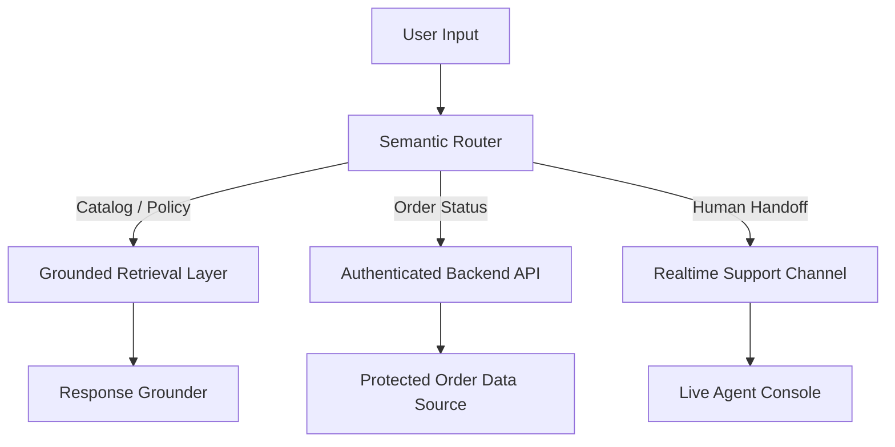

# AI Customer Support Agent for Commerce — Judge Verdict + Rebuild Brief

## Purpose

This document has two jobs:

1. Record the senior judge’s verdict on the current submission.
2. Define the minimum architectural changes required so AI coding agents can rebuild the project without guessing.

Treat this as an execution brief, not marketing copy.

---

## Project Context

**Project name:** AI Customer Support Agent for Commerce (Shopify Chat Widget)  
**Judging team:** Kasparro Senior Engineering Panel  
**Verdict date:** May 17, 2026  
**Reported test coverage:** 19 Vitest files passing (325/325 unit tests) and 12/12 Playwright E2E tests passing  
**Final score:** 58 / 100 — Bronze Tier

---

## Judge Summary

The current submission is visually polished but functionally weak.

The central issue is simple:

- The project is branded as an **AI** customer support agent.
- The implementation is mostly **rule-based**.
- There is no real semantic routing, no LLM-backed reasoning layer, and no secure backend flow for sensitive customer actions.

Do not let an agent reinterpret this into a “mostly fine” implementation. The critique is specific: the project needs real AI capability, real security boundaries, and real-time human handoff.

---

## Core Findings

### 1) Product Scope Problem
The product claims to be AI-driven, but the current behavior is closer to a scripted chatbot.

### 2) Technical Fragility
Intent detection appears to rely on hardcoded keyword matching and exact string checks. That breaks on typos, synonyms, and natural phrasing.

### 3) Security Risk
Customer/order data and tracking logic must not live in client-side memory. Sensitive lookup flows need a backend boundary.

### 4) Handoff Is Simulated
The current queue/escalation behavior is a local simulation, not a live support system.

### 5) UX Is Decorative
The terminal-style interface is visually strong but not enough on its own. The user experience needs better onboarding and action affordances.

---

## What the Live Shopify API Does and Does Not Solve

### It solves
- Live catalog and inventory freshness
- Reduction of manual updates to static product arrays
- Fewer redeploys for basic store content changes

### It does not solve
- Semantic typo tolerance
- AI routing or natural-language understanding
- Secure order lookup
- Human handoff
- Authentication for sensitive customer actions

### Important security note
Do **not** expose Shopify Admin credentials in browser code.  
Any sensitive order or customer lookup must go through a backend proxy with proper authentication.

---

## Required Rebuild Direction

The project should be rebuilt around four real capabilities:

1. **Semantic intent routing**
2. **Secure backend order handling**
3. **Live human handoff**
4. **Dynamic store content sync**

If the project remains purely rule-based, it should not be labeled as AI.

---

## Recommended Target Architecture

---

## Re-Engineering Plan

### 1. Semantic Typo Resilience
Replace brittle keyword checks with a real semantic router.

**Goal**
- Handle typos
- Handle synonyms
- Handle natural phrasing

**Implementation direction**
- Use ONNX Runtime Web with a lightweight sentence embedding model, or
- Use a server-side LLM router if client-side inference is too limited

**Expected result**
- Queries like “avialable?”, “in stock?”, and “got medium blue pants?” route correctly without hardcoded special cases.

---

### 2. Secure Order Lookup
Move order lookup behind a backend service.

**Goal**
- Prevent client-side exposure of customer and order data
- Require verification before returning sensitive order status

**Implementation direction**
- Add a serverless backend proxy
- Authenticate the request before querying the order system
- Use OTP or another verification flow where appropriate

**Expected result**
- The browser never holds raw order databases or privileged tokens.

---

### 3. Real Human Handoff
Replace the fake queue simulation with actual live support routing.

**Goal**
- Transfer a user to a real agent, not a local timer

**Implementation direction**
- Use WebSockets, Supabase Realtime, Pusher, or a similar realtime channel
- Build a separate agent console
- Fire a real handoff event when escalation is needed

**Expected result**
- A support agent can join the conversation live.

---

### 4. Dynamic Store Content Sync
Fetch catalog and policy information from live store sources.

**Goal**
- Avoid hardcoded policy text and product arrays
- Keep stock and price data current

**Implementation direction**
- Use Shopify Storefront API for public-facing catalog data
- Use a backend for privileged operations
- Separate public catalog reads from sensitive actions

**Expected result**
- Merchants do not have to edit TS arrays and redeploy for routine store updates.

---

### 5. Better UI Affordances
Keep the terminal aesthetic, but reduce confusion.

**Goal**
- Preserve visual identity
- Improve first-use clarity

**Implementation direction**
- Add quick command chips such as:
  - Track order
  - Check stock
  - Return item
- Add autocomplete or suggested actions
- Do not start with a blank screen that leaves users stranded

**Expected result**
- The interface feels intentional, not decorative.

---

## Non-Negotiable Constraints

- Do not call this AI unless it includes actual semantic routing or equivalent AI capability.
- Do not expose Admin API keys or customer data in client-side code.
- Do not fake live support with timeouts.
- Do not rely on exact substring matching for user intent.
- Do not force developers to hand-edit static arrays for core store updates.

---

## Acceptance Criteria

The rebuild is acceptable only if all of the following are true:

- User queries are routed by semantics, not only by exact keywords.
- Order lookup is authenticated and handled server-side.
- Human handoff uses a real realtime channel.
- Catalog and policy data are dynamically fetched.
- The system remains robust to typos and natural language variation.
- The final product can honestly be described as AI-assisted.

---

## Implementation Priority

1. Fix security first.
2. Replace brittle routing second.
3. Add realtime support third.
4. Connect live catalog data fourth.
5. Polish UX last.

Do not reverse this order.

---

## Final Note

The current build is not failing because of styling.  
It is failing because the core engine is too brittle, too exposed, and too heavily simulated.

The rebuild must make the system:
- semantically aware,
- secure by design,
- connected to live services,
- and honest about what it actually does.
